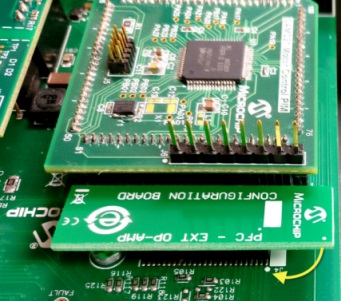
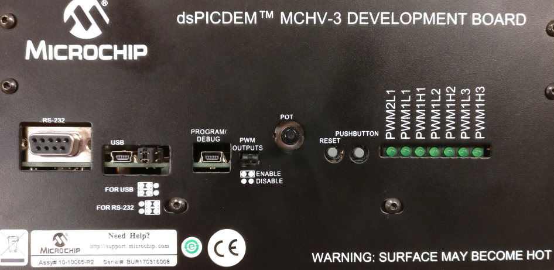
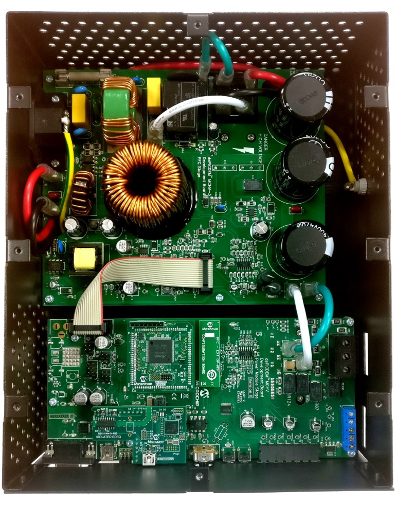

# MCHV3 Development Board
## Setting up the hardware

The following table shows the target hardware for the application projects.

| Project Name| Hardware |
|:---------|:---------:|
| mchv3_sam_e54_pim.X | [MCHV3 Development Board](https://www.microchip.com/developmenttools/ProductDetails/dm330023-3) [ATSAME54 Plug-in module](https://www.microchip.com/DevelopmentTools/ProductDetails/PartNO/MA320207) [Leadshine EL5-M0400-1-24 Motor](https://www.microchip.com/developmenttools/ProductDetails/AC300025)  [Isolated Embedded Debugger Interface](https://www.microchip.com/DevelopmentTools/ProductDetails/AC320202) |
|||

### Setting up [MCHV3 Development Board](https://www.microchip.com/developmenttools/ProductDetails/dm330023-3)

- Mount the ATSAME54 Motor Control Plug In Module on U9 header. 

    

- Place the "PFC - External Opamp Configuration" Matrix board at J4.

    

- Motor Connections: 
    - Phase U - M1 
    - Phase V - M2 
    - Phase W - M3

    

- Encoder Connections:
    - A+ - HA
    - B+ - HB
    - +5V - +5V
    - GND - G

    

- Jumper Settings: 
    - J11 - VAC ( Short Pin 3 - 4)
    - J12 - IA ( Short Pin 1 - 2)
    - J13 - IB ( Short Pin 1 - 2)
    - J14 - Fault_IP/IBUS ( Short Pin 1 - 2)

    

- Power the board with (110V/220V) AC mains. For additional safety, it is recommended to use a current limited power supply while testing this software demonstration on a non-default hardware and motor. 

    

- Installing Isolated Embedded Debugger
Default programmer or debugger daughter card shipped with the MCHV3 board cannot program or debug SAM series MCU and therefore, it needs to be replaced with an Isolated Embedded Debugger Interface for MCHV.

    

- Complete Setup

    

## Running the Application

1. Vary the POT (position reference) before PUSHBUTTON press for 'motor start'
2. Press PUSHBUTTON for 'motor start'. Observe the position control response. Then press PUSHBUTTON for 'motor stop'
3. Vary the POT again for different position reference
4. Press PUSHBUTTON for 'motor start'. Observe the position control response. Then press PUSHBUTTON for 'motor stop'
5. Continue the steps above for different reference positions

Refer to the following tables for switch and LED details:

| Switch | Description |
|------|----------------|
| PUSHBUTTON | To start or stop the motor |
||

| LED D2 Status | Description |
|------|----------------|
| OFF  | No fault  |
| ON   | Fault is detected  |
||