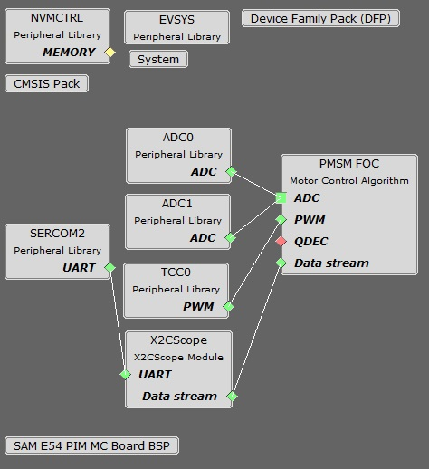

# PMSM FOC using PLL Estimator

This example application shows how to control the Permanent Magnet Synchronous Motor (PMSM) with PLL Estimator based Field Oriented Control (FOC) on a SAME54 Micro-controller. 

## Description

Permanent Magnet Synchronous Motor (PMSM) is controlled using Field Oriented Control (FOC). Rotor position and speed is determined using PLL estimator technique. Motor start/stop operation is controlled by the switch and motor speed can be changed by the on-board potentiometer. Waveforms and variables can be monitored runtime using X2CScope. 

Key features enabled in this project are:

- Dual shunt current measurement
- Speed control loop
- Field weakening

## MCC Project Configurations

- **PMSM_FOC**: 
    This component configures FOC algorithm parameters, motor parameters and motor control board parameters. It connects to underlying peripheral libraries ADC and TCC. This component auto configures ADC channels and PWM channels as per PMSM_FOC component configurations. 
	
- **ADC0-ADC1**: 

   ADC0 and ADC1 are setup to operate in Master - Slave mode with ADC0 acting as a Master

   Both ADCs convert single ended inputs. Phase U current is sampled and converted by ADC0 and Phase V current is sampled and converted by ADC1

   Both ADCs are hardware triggered simultaneously by an event generated from TCC0 at the end of each PWM cycle

   Conversion Ready interrupt is generated by ADC0. Since both ADCs are triggered simultaneously and have the same resolution and sampling time, both ADCs complete conversion at the same time

- **TCC0**: 

    This peripheral is used to generated three phase synchronous PWM waveforms. Fault functionality is also enabled to switch off the output waveforms asynchronously.
- **EIC**:

    External Interrupt Controller detects a hardware over-current fault input and generates a non-recoverable fault event for TCC0, thereby shutting down the PWM in the event of an over-current fault
- **EVSYS**:

    Event System acts as an intermediary between event generator and event users

    Event generated by the TCC0 when the counter reaches TOP, is used by the ADC0 as a hardware trigger source via the Event System

    Event generated by the EIC upon over-current fault, is used by the TCC0 as a non-recoverable fault event via Event System
- **SERCOM2**:

    SERCOM2 is configured in USART mode and is set to operate at 115200 bps

    This USART channel is used by the X2CScope plugin to plot or watch global variables in run-time. Refer to X2C Scope Plugin section for more details on how to install and use the X2CScope
- **X2CScope**: 

    This component adds X2C scope protocol code. This uses UART to communicate to the host PC. X2CScope allows user to monitor variables runtime.
- **UART Peripheral**: 

    The UART is used for X2CScope communication to observe graphs and variable values in run time 

## Project Details
This project has been created using Harmony QSpin Tool. For details refer [Harmony QSpin](https://microchip-mplab-harmony.github.io/motor_control/index.html)

## Development Kits

### MCLV2 with ATSAME54 PIM
#### Downloading and building the application

To clone or download this application from Github, go to the [main page of this repository](https://github.com/Microchip-MPLAB-Harmony/mc_apps_sam_d5x_e5x) and then click **Clone** button to clone this repository or download as zip file.
This content can also be downloaded using content manager by following these [instructions](https://github.com/Microchip-MPLAB-Harmony/contentmanager/wiki).

Path of the application within the repository is **apps/pmsm_foc_pll_estimator_sam_e54** .

To build the application, refer to the following table and open the project using its IDE.

| Project Name      | Description                                    | Demo User Guide |
| ----------------- | ---------------------------------------------- | -------------- |
| mclv2_sam_e54_pim.X | MPLABX project for MCLV2 board with ATSAME54 PIM | [Hardware Setup and Running The Application on MCLV2 with ATSAME54 PIM](../docs/mclv2_atsame54_pim_sensorless.md) |
||||

### MCHV3 with ATSAME54 PIM
#### Downloading and building the application

To clone or download this application from Github, go to the [main page of this repository](https://github.com/Microchip-MPLAB-Harmony/mc_apps_sam_d5x_e5x) and then click **Clone** button to clone this repository or download as zip file.
This content can also be downloaded using content manager by following these [instructions](https://github.com/Microchip-MPLAB-Harmony/contentmanager/wiki).

Path of the application within the repository is **apps/pmsm_foc_pll_estimator_sam_e54** .

To build the application, refer to the following table and open the project using its IDE.

| Project Name      | Description                                    | Demo User Guide |
| ----------------- | ---------------------------------------------- | -------------- |
| mchv3_sam_e54_pim.X | MPLABX project for MCHV3 board with ATSAME54 PIM | [Hardware Setup and Running The Application on MCHV3 with ATSAME54 PIM](../docs/mchv3_atsame54_pim_sensorless.md) |
||||