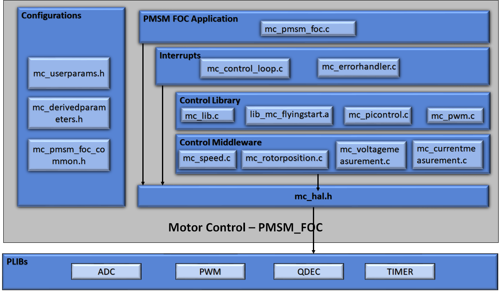
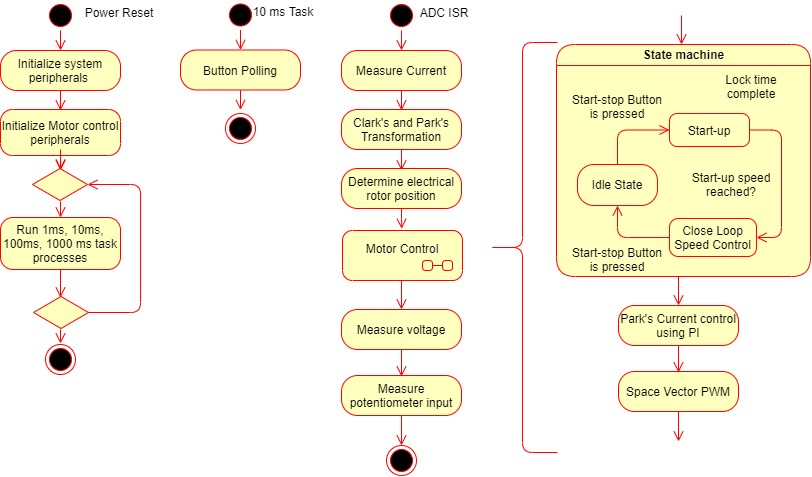

# PMSM FOC using Quadrature Encoder

This example application shows how to control the Permanent Magnet Synchronous Motor (PMSM) with Quadrature Encoder based Field Oriented Control (FOC) on a SAME54 Micro-controller. 

## Description

Permanent Magnet Synchronous Motor (PMSM) is controlled using Field Oriented Control (FOC). Rotor position and speed is determined using quadrature encoder sensor. Motor start/stop operation is controlled by the switch and motor speed can be changed by the on-board potentiometer. Waveforms and variables can be monitored runtime using X2CScope. 

Key features enabled in this project are:

- Dual shunt current measurement
- Speed control loop
- Field weakening

## MHC Project Configurations

- **ADC0-ADC1**: 

   ADC0 and ADC1 are setup to operate in Master - Slave mode with ADC0 acting as a Master

   Both ADCs convert single ended inputs. Phase U current is sampled and converted by ADC0 and Phase V current is sampled and converted by ADC1

   Both ADCs are hardware triggered simultaneously by an event generated from TCC0 at the end of each PWM cycle

   Conversion Ready interrupt is generated by ADC0. Since both ADCs are triggered simultaneously and have the same resolution and sampling time, both ADCs complete conversion at the same time

- **TCC0**: 

    This peripheral is used to generated three phase synchronous PWM waveforms. Fault functionality is also enabled to switch off the output waveforms asynchronously.
- **PDEC Peripheral**:

    It is used to decode the rotor position and speed from quadrature encoder signals.
- **EIC**:

    External Interrupt Controller detects a hardware over-current fault input and generates a non-recoverable fault event for TCC0, thereby shutting down the PWM in the event of an over-current fault
- **EVSYS**:

    Event System acts as an intermediary between event generator and event users

    Event generated by the TCC0 when the counter reaches TOP, is used by the ADC0 as a hardware trigger source via the Event System

    Event generated by the EIC upon over-current fault, is used by the TCC0 as a non-recoverable fault event via Event System
- **SERCOM2**:

    SERCOM2 is configured in USART mode and is set to operate at 115200 bps

    This USART channel is used by the X2CScope plugin to plot or watch global variables in run-time. Refer to X2C Scope Plugin section for more details on how to install and use the X2CScope
- **X2CScope**: 

    This component adds X2C scope protocol code. This uses UART to communicate to the host PC. X2CScope allows user to monitor variables runtime.
- **UART Peripheral**: 

    The UART is used for X2CScope communication to observe graphs and variable values in run time 

## Control Algorithm

This section briefly explains the FOC control algorithm, software design and implementation. Refer to [Application note AN2757](https://www.microchip.com/wwwAppNotes/AppNotes.aspx?appnote=en607365) for the quadrature encoder based sensored FOC technique in detail. 

Field Oriented Control is the technique used to achieve the decoupled control of torque and flux. This is done by transforming the stator current quantities (phase currents) from stationary reference frame to torque and flux producing currents components in rotating reference frame using mathematical transformations. The Field Oriented Control is done as follows: 

1. Measure the motor phase currents. 
2. Transform them into the two phase system (a, b) using the Clarke transformation. 
3. Calculate the rotor position angle. 
4. Transform stator currents into the d,q-coordinate system using the Park transformation. 
5. The stator current torque (iq) and flux (id) producing components are controlled separately by the controllers. 
6. The output stator voltage space vector is transformed back from the d,q-coordinate system into the two phase system fixed with the stator by the Inverse Park transformation. 
7. Using the space vector modulation, the three-phase output voltage is generated. 

**Quadrature Encoder based FOC** :

Rotor position and speed are determined using quadrature encoder sensor. PDEC counts
the decoded quadrature pulses which is the position of the rotor. In this example, counter is a free running counter and software logic is implemented to get the exact angular position from the count. Speed is calculated by measuring the number of quadrature pulses in a fixed time interval. 

Rotor is first aligned to a known position by exiciting either d-axis or q-axis. And then motor is controlled in a closed loop there after. 

The following block diagram shows the software realization of the FOC algorithm.

## Software Design

-   PMSM FOC Control loop is implemented in the ADC result ready interrupt. Refer to the flow chart given below. 
-   ADC channel conversion is triggered by the PWM overflow/zero match event. This trigger point could vary based on the current measurement techniques and MCU PWM IP implementation.
-   ADC interrupt frequency depends on the PWM frequency.
-   Slow loop task is executed 10 times slower than ADC interrupt. Polling of switches for user inputs and reference speed calculation is handled in the slow loop task. 

### Timing Diagram

### Flow Chart

### State Machine

-   **Idle**:

In this state, control waits for the switch press. 

-   **Flying Start**:

In this state, the control algorithm detects if the motor is freewheeling. If the motor's freewheeling speed is above the minimum Flying Start Detect speed and in the same direction as the command direction, the state machine directly enters in to "Closed Loop" state. 

However, if the freewheeling speed is less than minimum Flying Start Detect speed, the control algorithm attempts to passive brake the motor by applying pulses of "NUll Vectors". 

If the freewheeling speed is more than the minimum Flying Start Detect speed but in the opposite direction of the command direction, the control algorithm attempts to active brake the motor by regenerative braking (if enabled). Once the motor speed falls below the minimum Flying Start Detect speed, the control algorithm attempts to passive brake the motor by applying pulses of "NUll Vectors". 

-   **Field Alignment**:

Rotor is aligned to known position at D-axis or Q-axis by applying a pre-defined value of the current for a pre-defined length of time. The magnitude of the current and the length of the time for which it is applied depends upon the electrical and mechanical time constant of the PMSM motor drive. Electrical time constant of the motor is a function of R and L values of the motor windings, whereas the mechanical time constant of the motor drive is primarily a function of the static load on the motor shaft. 

-   **Open Loop**:

This state is applicable to sensorless position feedback methods. In this state, the speed of the PMSM motor is gradually ramped up using an open loop control. During this mode, the rotor angle is derived from the asserted open loop speed reference. This derived rotor angle would be lagging from the actual rotor angle. The speed is ramped up linearly to a minimum value required for the PLL estimator to estimate the electrical speed of the PMSM motor with sufficient accuracy. Rotor angle information is obtained by integrating the estimated electrical speed of the motor. 

-   **Closing Loop**:

In this state, control waits for stabilization time. 

-   **Closed Loop**:

Control switched to closed loop and rotor angle is obtained from the configured position feedback method. 

### Code Structure

Configurations: 
-   mc_userparameters.h contains the user configurations. 
-   mc_derivedparameters.h contains the calculated values used in the code. 
-   mc_pmsm_foc_common.h - common data structures and defines 

PMSM_FOC: 
-   mc_pmsm_foc.c/h - PMSM FOC algorithm interface file 

Interrupts: 
-   mc_control_loop.c - Control loop is implemented in the ADC result ready ISR. 
-   mc_errorhandler.c - PWM fault ISR to take corrective action on over-current 

Control library: 
-   mc_lib.c/h - FOC library 
-   mc_picontroller.c/h - PI controller implementation 
-   mc_pwm.c/h - Space Vector modulation (SVM) and updating PWM duty cycles 
-   lib_mc_flyingstart.a - Flying Start Control Library

Control Middleware: 
-   mc_speed.c/h - Calculate the reference speed 
-   mc_rotorposition.c/.h - Calculate the position and speed of the rotor 
-   mc_voltagemeasurement.c/h - Get the DC Bus voltage 
-   mc_currentmeasurement.c/h - Get the motor phase currents 

HAL: 
-   mc_hal.h - Hardware Abstraction Layer to interact with PLIBs 

### 2. SAMC21 and PIC32CM MC
-   PMSM FOC Control loop is implemented in the ADC result ready interrupt. Refer to the flow chart given below. 
-   ADC channel conversion is triggered by the PWM overflow/zero match event. This trigger point could vary based on the current measurement techniques and MCU PWM IP implementation.
-   For bandwidth constraints, the FOC is executed every alternate PWM cycle
-   Slow loop task is executed in every 10ms in the task process. Polling of switches for user inputs is handled in the slow loop task. 

### Timing Diagram

### Flow Chart

### State Machine

-   **Idle**:

In this state, control waits for the switch press. 

-   **Field Alignment**:

Rotor is aligned to known position at D-axis or Q-axis by applying a pre-defined value of the current for a pre-defined length of time. The magnitude of the current and the length of the time for which it is applied depends upon the electrical and mechanical time constant of the PMSM motor drive. Electrical time constant of the motor is a function of R and L values of the motor windings, whereas the mechanical time constant of the motor drive is primarily a function of the static load on the motor shaft. 

-   **Closed Loop**:

Control switched to closed loop and rotor angle is obtained from the configured position feedback method. 

### Code Structure

Configurations: 
-   mc_userparameters.h contains the user configurations. 

PMSM FOC Application: 
-   mc_pmsm_foc.c/h - PMSM FOC algorithm interface file 

Interrupts: 
-   mc_function_coordinator.c - Initializes and coordinates motor control ISR and slow task processes
-   mc_error_handler.c - PWM fault ISR to take corrective action on over-current 

Control Middleware: 
-   mc_motor_control.c/h - Implements the motor control state machines.

Control library: 
-   mc_start_up.c/h - Implements the initial field alignment and open loop start-up profile.
-   mc_speed_control.c/h - Calculate and regulates the reference speed
-   mc_current_control.c/h - Controls the direct and quadrature axis currents
-   mc_rotor_position.c/.h - Calculate the position and speed of the rotor 
-   mc_voltage_measurement.c/h - Get the DC Bus voltage 
-   mc_current_measurement.c/h - Get the motor phase currents 
-   mc_interface_handling.c/h - Manages global variables and data-types
-   mc_generic_library.c/h - FOC library 
-   mc_pwm.c/h - Space Vector modulation (SVM) and updating PWM duty cycles 
-   mc_ramp_profiler.c/h - Speed reference profiles for user inputs 

HAL: 
-   mc_hardware_abstraction.c/h - Hardware Abstraction Layer to interact with PLIBs 

## Development Kits

### MCLV2 with ATSAME54 PIM
#### Downloading and building the application

To clone or download this application from Github, go to the [main page of this repository](https://github.com/Microchip-MPLAB-Harmony/mc_apps_sam_d5x_e5x) and then click **Clone** button to clone this repository or download as zip file.
This content can also be downloaded using content manager by following these [instructions](https://github.com/Microchip-MPLAB-Harmony/contentmanager/wiki).

Path of the application within the repository is **apps/pmsm_foc_encoder_sam_e54** .

To build the application, refer to the following table and open the project using its IDE.

| Project Name      | Description                                    | Demo User Guide |
| ----------------- | ---------------------------------------------- | ---------------- |
| mclv2_sam_e54_pim.X | MPLABX project for MCLV2 board with ATSAME54 PIM | [Hardware Setup and Running The Application on MCLV2 with ATSAME54 PIM](../docs/mclv2_atsame54_pim_encoder.md) |
||||

### MCHV3 with ATSAME54 PIM
#### Downloading and building the application

To clone or download this application from Github, go to the [main page of this repository](https://github.com/Microchip-MPLAB-Harmony/mc_apps_sam_d5x_e5x) and then click **Clone** button to clone this repository or download as zip file.
This content can also be downloaded using content manager by following these [instructions](https://github.com/Microchip-MPLAB-Harmony/contentmanager/wiki).

Path of the application within the repository is **apps/pmsm_foc_encoder_sam_e54** .

To build the application, refer to the following table and open the project using its IDE.

| Project Name      | Description                                    | Demo User Guide |
| ----------------- | ---------------------------------------------- | ---------------- |
| mchv3_sam_e54_pim.X | MPLABX project for MCHV3 board with ATSAME54 PIM | [Hardware Setup and Running The Application on MCHV3 with ATSAME54 PIM](../docs/mchv3_atsame54_pim_encoder.md)|
||||

