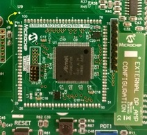
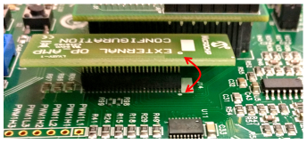
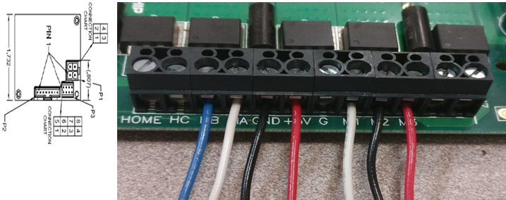
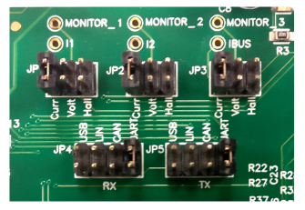
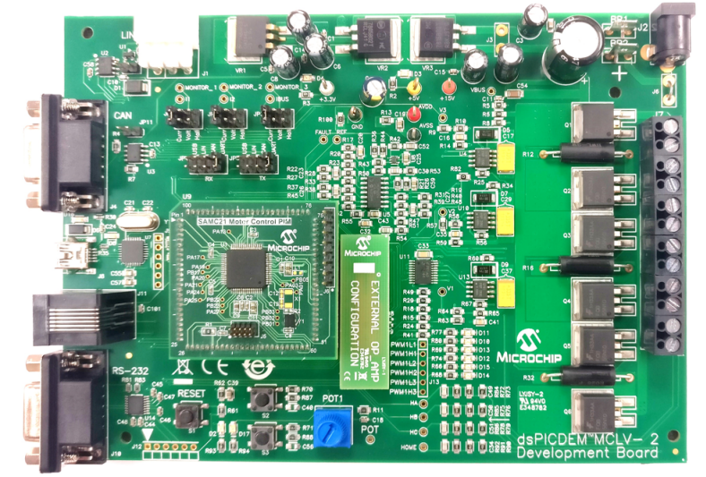

# MCLV2 Development Board - Setup and Running 'Position Control of PMSM with Quadrature Encoder'
**Setting up the hardware**

The following table shows the target hardware for the application projects.

| Project Name| Hardware |
|:---------|:---------:|
| mclv2_sam_e54_pim.X | [MCLV2 Development Board](https://www.microchip.com/DevelopmentTools/ProductDetails/DM330021-2) [ATSAME54 Plug-in module](https://www.microchip.com/DevelopmentTools/ProductDetails/PartNO/MA320207) [Hurst Motor with encoder](https://www.microchip.com/DevelopmentTools/ProductDetails/PartNo/AC300022) |
|||

**Setting up [MCLV2 Development Board](https://www.microchip.com/DevelopmentTools/ProductDetails/DM330021-2)**

- Mount the ATSAME54 Motor Control Plug In Module on U9 header. 

    

- Place the "External Opamp Configuration" Matrix board at J14

    

- Motor Connections: 
    - Phase U - M1 (White coloured wire)
    - Phase V - M2 (Black coloured wire)
    - Phase W - M3 (Red coloured wire)

    

- Encoder Connections: Connect encoder wires as shown below
    - 1 : +5V (Red coloured wire)
    - 2 : HA (White coloured wire)
    - 3 : HB (Blue coloured wire)
    - 8 : GND (Black coloured wire)

    

- Jumper Settings: 
    - JP1 - Curr, JP2 - Curr, JP3 - Curr 
    - In order to use RS232 port for X2CScope Communication JP4 - UART, JP5 - UART 
    - In order to use USB port for X2CScope Communication JP4 - USB, JP5 - USB

    

- Power the board with a 24V DC supply using J2 or BP1-BP2. For additional safety, it is recommended to use a current limited power supply while testing this software demonstration on a non-default hardware and motor. 

    

- Complete Setup

    

**Running the Application**

1. Build and Program the application using its IDE
2. Press switch S2 to start the motor
3. Vary potentiometer to change the reference rotor position of the motor
4. Observe waveforms on X2CScope scope view
5. Press the Switch S2 to stop the motor

Refer to the following tables for switch and LED details:

| Switch | Description |
|------|----------------|
| Switch S2 | To start or stop the motor |
||

| LED D17 Status | Description |
|------|----------------|
| OFF  | No fault  |
| ON   | Fault is detected  |
||