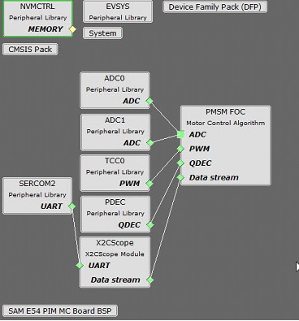
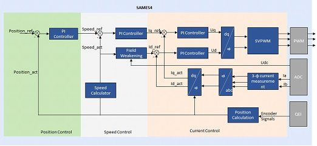
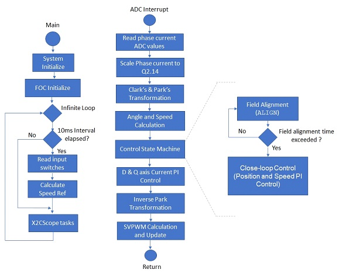
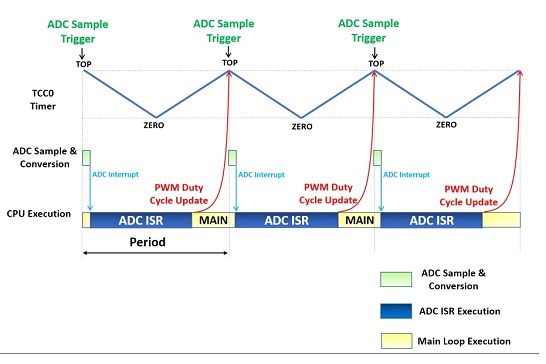

# FOC Based Position Control of PMSM Using Quadrature Encoder

This motor control example project shows how to control the position of Permanent Magnet Synchronous Motor (PMSM) using an Encoder based Field Oriented Control (FOC) on SAME54 Micro-controller.

**Description**
The permanent magnet synchronous motors ( PMSM ) is widely used in various industries due to its high power density, smaller size and high efficiency. The Field oriented control is one of the most popular control mechanisms for the PMSM motor for applications which requires high dynamic performance.

This example shows how to configure motor control peripherals ADC, PDEC and TCC for the control operation. The control strategy is the sensored FOC, in which rotor position is determined by the Quadrature Encoder. Position is obtained using quadrature encoder and speed is calculated from the position.

Waveforms and variables can be monitored at runtime using X2CScope. 

Key features enabled in this project are:

- Dual shunt current measurement
- Speed control loop
- Position control loop

**MHC Project Configurations**

- **ADC0-ADC1**: 

   ADC0 and ADC1 are setup to operate in Master - Slave mode with ADC0 acting as a Master

   Both ADCs convert single ended inputs. Phase U current is sampled and converted by ADC0 and Phase V current is sampled and converted by ADC1

   Both ADCs are hardware triggered simultaneously by an event generated from TCC0 at the end of each PWM cycle

   Conversion Ready interrupt is generated by ADC0. Since both ADCs are triggered simultaneously and have the same resolution and sampling time, both ADCs complete conversion at the same time

- **TCC0**: 

    This peripheral is used to generated three phase synchronous PWM waveforms. Fault functionality is also enabled to switch off the output waveforms asynchronously.
- **PDEC Peripheral**:

    It is used to decode the rotor position and speed from quadrature encoder signals.
- **EIC**:

    External Interrupt Controller detects a hardware over-current fault input and generates a non-recoverable fault event for TCC0, thereby shutting down the PWM in the event of an over-current fault
- **EVSYS**:

    Event System acts as an intermediary between event generator and event users

    Event generated by the TCC0 when the counter reaches TOP, is used by the ADC0 as a hardware trigger source via the Event System

    Event generated by the EIC upon over-current fault, is used by the TCC0 as a non-recoverable fault event via Event System
- **SERCOM2**:

    SERCOM2 is configured in USART mode and is set to operate at 115200 bps

    This USART channel is used by the X2CScope plugin to plot or watch global variables in run-time. Refer to X2C Scope Plugin section for more details on how to install and use the X2CScope

**Control Algorithm**

This section briefly explains the FOC control algorithm, software design and implementation. 

Field Oriented Control is the technique used to achieve the decoupled control of torque and flux. This is done by transforming the stator current quantities (phase currents) from stationary reference frame to torque and flux producing currents components in rotating reference frame using mathematical transformations. The Field Oriented Control is done as follows: 

1. Measure the motor phase currents. 
2. Transform them into the two phase system (a, b) using the Clarke transformation. 
3. Calculate the rotor position angle. 
4. Transform stator currents into the d,q-coordinate system using the Park transformation. 
5. Position and speed are controlled by position and speed PI controllers respectively.
6. The stator current torque (iq) and flux (id) producing components are controlled separately by the corresponding PI controllers. 
7. The output stator voltage space vector is transformed back from the d,q-coordinate system into the two phase system fixed with the stator by the Inverse Park transformation. 
8. Using the space vector modulation, the three-phase output voltage is generated. 

**Quadrature Encoder based Position and Speed Measurement** :

Rotor position and speed are determined using quadrature encoder sensor. PDEC counts
the decoded quadrature pulses which is the position of the rotor. In this example, counter is a free running counter and software logic is implemented to get the exact angular position from the count. Speed is calculated by measuring the number of quadrature pulses in a fixed time interval. 

Rotor is first aligned to a known position by exiciting either d-axis or q-axis. Motor's position is controlled in a closed loop there after. 

The following block diagram shows the software realization of the FOC algorithm.

**Software Design**

The following figure shows the various state machines of the the motor control software. 

In the software, the PMSM position control task is realized by a state machine as shown in the previous figure. The following sections briefly describe the various states in the PMSM position control:

**INITIALIZE**
In this state, following tasks are performed:
1. Initialization and configuration of motor control peripherals for generation of periodic ADC triggers and ADC conversion interrupt
2. Current Offset measurement and calibration
3. Initialize PI controller parameters for speed and current control loops

**START**
In this state, the motor control state variables are reset and the periodic ADC conversion interrupt is enabled. Control waits for the switch press.

**Run**
In this state, the motor starts spinning. The below flow chart and the timing diagram shows the tasks performed in run state:

The position control is carried out in the ADC interrupt task

**Development Kits**

**MCLV2 with ATSAME54 PIM**
**Downloading and building the application**

To clone or download this application from Github, go to the [main page of this repository](https://github.com/Microchip-MPLAB-Harmony/mc_apps_sam_d5x_e5x) and then click **Clone** button to clone this repository or download as zip file.
This content can also be downloaded using content manager by following these [instructions](https://github.com/Microchip-MPLAB-Harmony/contentmanager/wiki).

Path of the application within the repository is **apps/pmsm_foc_encoder_position_sam_e54** .

To build the application, refer to the following table and open the project using its IDE.

| Project Name      | Description                                    | Demo User Guide |
| ----------------- | ---------------------------------------------- | --------------- |
| mclv2_sam_e54_pim.X | MPLABX project for MCLV2 board with ATSAME54 PIM | [Hardware Setup and Running The Application on MCLV2 with ATSAME54 PIM](GUID-ADA749A6-70E8-4A1F-8019-5EC170A1250C.md) |
||||

**MCHV3 with ATSAME54 PIM**
**Downloading and building the application**

To clone or download this application from Github, go to the [main page of this repository](https://github.com/Microchip-MPLAB-Harmony/mc_apps_sam_d5x_e5x) and then click **Clone** button to clone this repository or download as zip file.
This content can also be downloaded using content manager by following these [instructions](https://github.com/Microchip-MPLAB-Harmony/contentmanager/wiki).

Path of the application within the repository is **apps/pmsm_foc_encoder_position_sam_e54** .

To build the application, refer to the following table and open the project using its IDE.

| Project Name      | Description                                    | Demo User Guide |
| ----------------- | ---------------------------------------------- | ------------------- |
| mchv3_sam_e54_pim.X | MPLABX project for MCHV3 board with ATSAME54 PIM | [Hardware Setup and Running The Application on MCHV3 with ATSAME54 PIM](GUID-38AE3206-A3BE-4C3F-BEE1-FF3D4CD29663.md)|
||||

